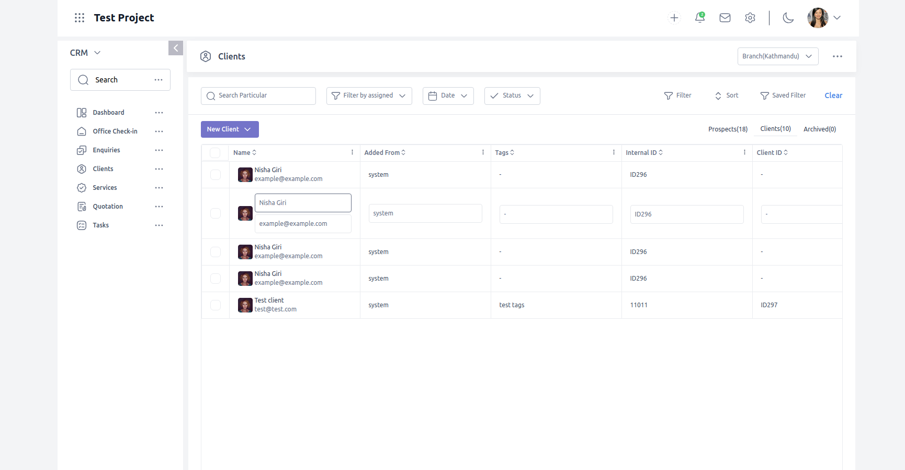
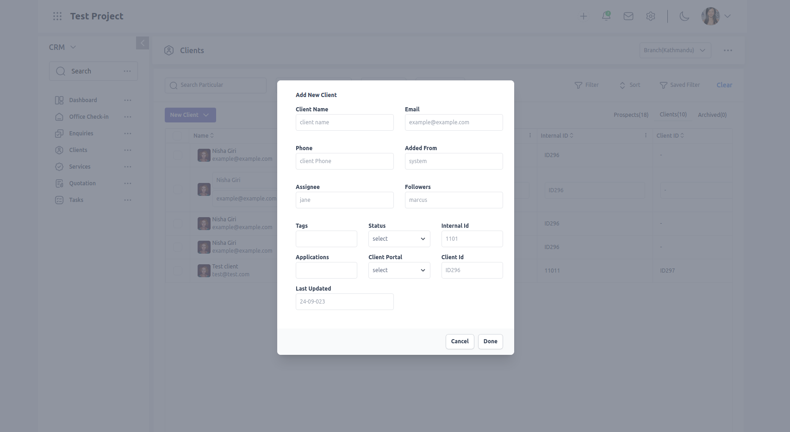
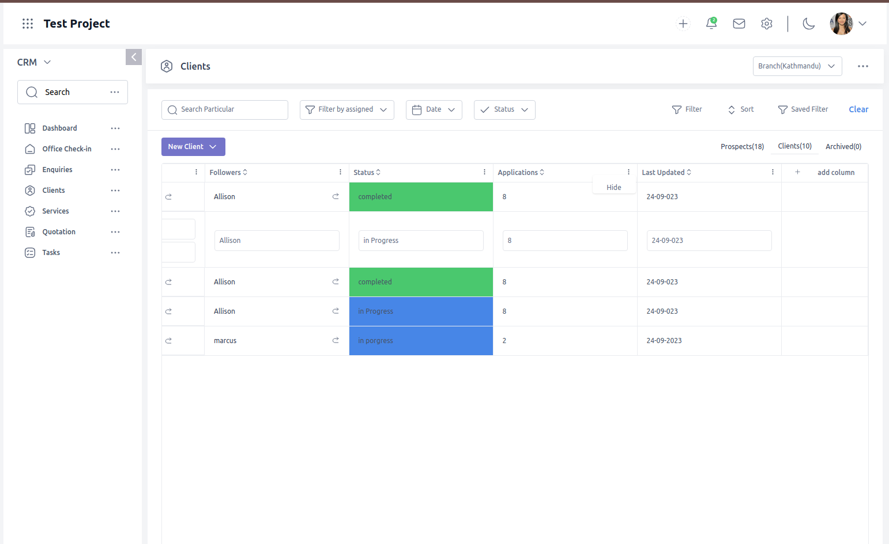
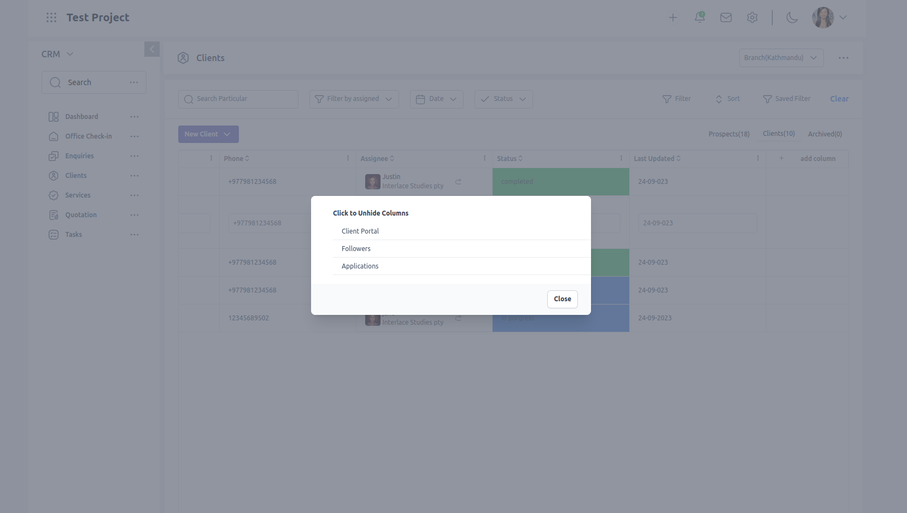

This project is completed ui test conducted by Nipuna Prabidhik Sewa.

# Clone the repository

Clone this github repository to your local environment.

## `npm install`

Running This script will install all the dependencies for the application.

### `npm start`

Runs the app in the development mode.\
Open [http://localhost:3000](http://localhost:3000) to view it in your browser.

The page will reload when you make changes.\
You may also see any lint errors in the console.

## Design of the page

## Adding new client

## Hiding a Column

## Showing hidden columns

